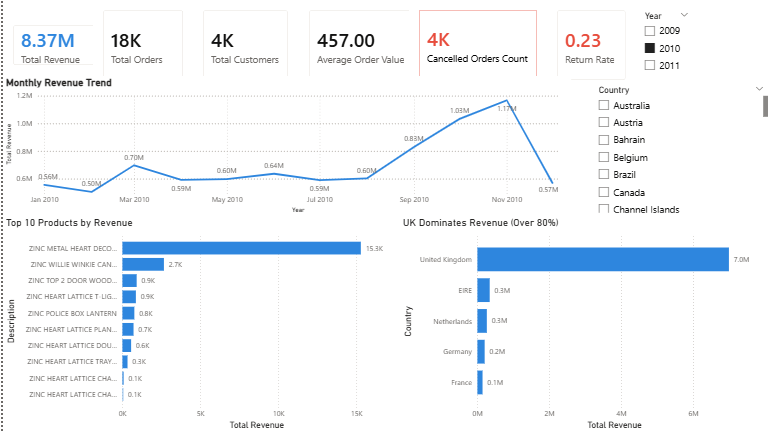
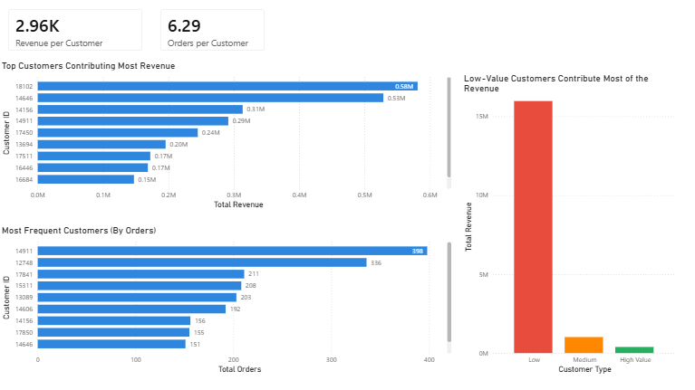
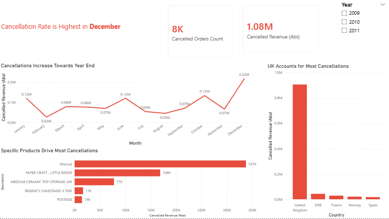

# 📊 Retail Customer Analytics & Prediction

## 🌐 Live Dashboard

👉 [View Interactive Power BI Dashboard](https://app.powerbi.com/links/HbbtespNEg?ctid=13e5772d-fae9-4291-8e92-3ee771b9ec38&pbi_source=linkShare)

---

## 📌 Project Overview

This project analyzes retail transaction data to uncover insights about sales performance, customer behavior, and business risks.
It combines **Business Intelligence (Power BI)** with **Predictive Analytics (Python)** to support data-driven decision making.

---

## 🎯 Objectives

* Analyze historical sales performance
* Identify top products and key markets
* Understand customer behavior and segmentation
* Detect patterns in cancellations
* Build predictive models for business insights

---

## 🧱 Project Structure

```
Retail-Customer-Analytics-and-Prediction/
│
├── Dashboard/
│   └── retail_dashboard.pbix
│
├── Data/
│   ├── raw_data.xlsx
│   └── cleaned_data.xlsx
│
├── Models/
│   ├── model.ipynb
│   └── results.csv
│
├── Images/
│   ├── overview.png
│   ├── customer.png
│   ├── time.png
│   ├── cancelled.png
│   ├── geo.png
│   └── insights.png
│
├── README.md
└── report.pdf
```

---

## 📊 Dashboard Pages

### 1. Overview

* Total Revenue, Orders, Customers
* Sales trends over time
* Top products and countries

---

### 2. Customer Analysis

* Top customers by revenue
* Most frequent customers
* Customer segmentation

---

### 3. Time Analysis

* Sales trends by month
* Peak sales hours (around 12 PM)
* Weekday vs weekend performance

---

### 4. Cancelled Orders Analysis

* Cancellation trends over time
* Countries with highest cancellations
* Products driving cancellations

---

### 5. Geographical Analysis

* Revenue distribution across countries
* Comparison with and without the UK

---

### 6. Key Insights

* Revenue reached **17.37M** with strong growth
* The UK contributes the majority of revenue (~80%)
* Sales peak around **12 PM**
* Low-value customers drive most revenue
* Cancellations increase in **December**

---

## 🤖 Predictive Modeling (In Progress)

This project will include machine learning models such as:

* Customer segmentation (Clustering)
* Sales prediction (Regression)
* Customer behavior analysis

---

## 🛠 Tools & Technologies

* Power BI
* Excel (Data Cleaning)
* Python (Pandas, Scikit-learn)
* DAX

---

## 📷 Dashboard Preview







---

## 📈 Key Insights

* Revenue is heavily concentrated in the UK market
* Customer behavior varies across segments
* Sales activity peaks at midday
* A small number of products drive cancellations

---

## ⚠️ Limitations

* Dataset limited to historical transactions
* No real-time data integration
* Predictive models are under development

---

## 🚀 Future Work

* Integrate machine learning models into Power BI
* Add forecasting capabilities
* Improve customer segmentation (RFM Analysis)

---

## 👤 Author

**Mohammad Ali Othman**
Data Science Student | BI & Data Analytics Enthusiast
